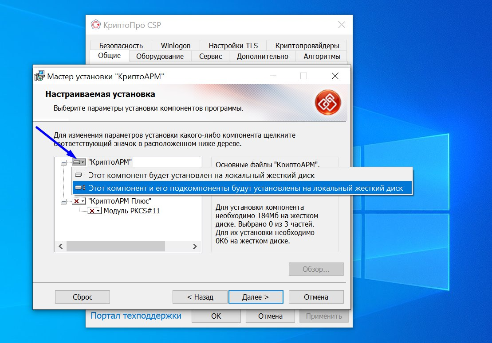
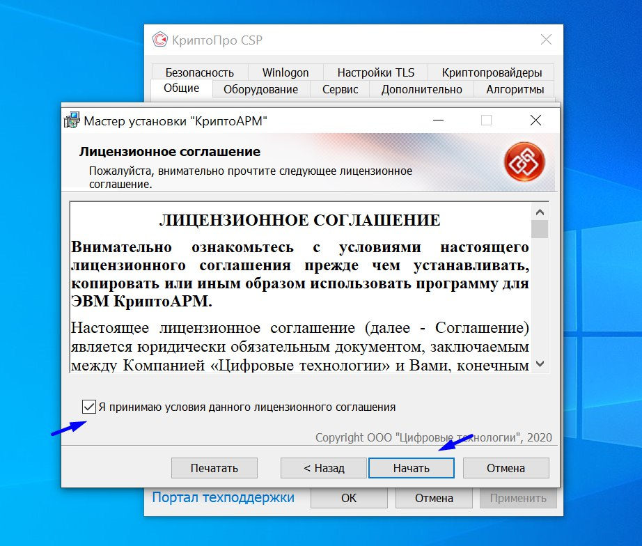
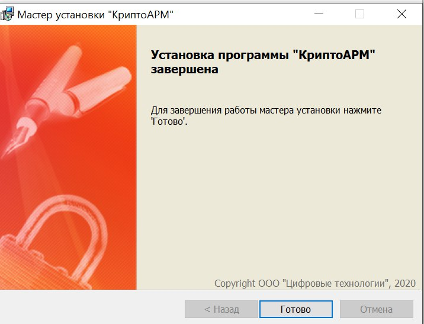
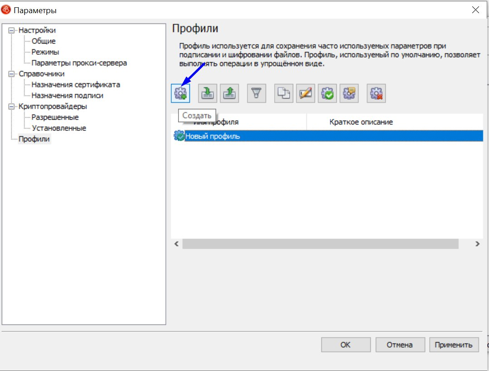
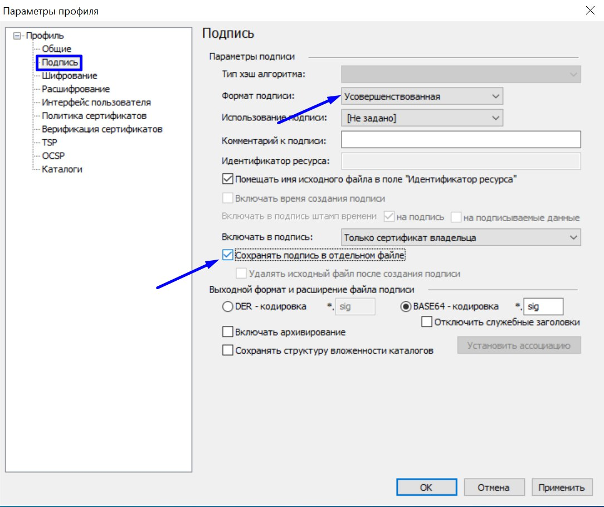
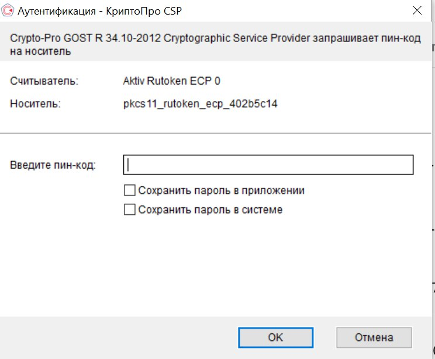

# КриптоАРМ

Подробнее об установке модуля Крипто АРМ

Перейдите на сайт [https://cryptoarm.ru/cryptoarm-5/](https://cryptoarm.ru/cryptoarm-5/)  и приобретите модуль КриптоАРМ.

## Установка КриптоАРМ 5

1. После запуска  выбрать "Настраиваемая установка", затем "Далее".

<figure><figcaption></figcaption></figure>

2. Выбрать для "КриптоАРМ" вариант «Этот компонент и его подкомпоненты будут установлены на локальный жесткий диск» и нажать "Далее".

<figure><figcaption></figcaption></figure>

3. Ознакомиться и принять "Лицензионное соглашение".

<figure><figcaption></figcaption></figure>

&#x20;4\. После установки нажать "Готово".

<figure><figcaption></figcaption></figure>


**После завершения установки необходимо перезагрузить компьютер.**&#x20;


## Настройка КриптоАРМ _(10 шагов и вы у цели!)_

1. Открыть КриптоАРМ (Для КриптоАРМ на рабочем столе будет создан ярлык, необходимо кликнуть по нему).

&#x20;\

<figure><figcaption></figcaption></figure>

2. &#x20; В пункте меню "Помощь" установить лицензию.

<figure><figcaption></figcaption></figure>

3. Прописать лицензионные ключи и нажать "Ок".&#x20;
4. Выбрать в меню КриптоАРМ "Профили" - "Управление профилями" -"Создать".

<figure><figcaption></figcaption></figure>

5\. В пункте «Общие» прописать имя профиля и указать сертификат пользователя с помощью кнопки «Выбрать».

<figure><figcaption></figcaption></figure>

6. В пункте "Подпись" установить формат подписи на "Усовершенствованная".&#x20;


**Для создания открепленной подписи установить галочку "Сохранять подпись в отдельном файле" (без установленной галочки будет создаваться прикрепленная подпись).**


<figure><figcaption></figcaption></figure>

7. В пункте "TSP" в поле "Адрес службы штампов времени" указать адрес службы штампов времени (например, [http://tax4.tensor.ru/tsp/tsp.srf](http://tax4.tensor.ru/tsp/tsp.srf)).

<figure><figcaption></figcaption></figure>

8.  В пункте "OCSP" в поле "Адрес сервера" необходимо указать адрес OCSP сервера, указанный указан в свойствах сертификата пользователя.

    1. Открыть Certificates через меню Пуск.
    2. Выбрать пункт "Доступ к информации о центрах сертификации"/Authority Information Access.
    3.  Скопировать URL.&#x20;

        <figure><figcaption></figcaption></figure>
    4. Вставить полученный URL&#x20;

    <figure><figcaption></figcaption></figure>
9. Выбрать в пункте "Профили" созданный профиль "По умолчанию".

<figure><figcaption></figcaption></figure>

10. Выполнить настройку в пункте "Режимы" (по желанию - необязательное условие).

<figure><figcaption></figcaption></figure>

**Настройка завершена. Поздравляем!**\

## Подробнее о подписании документа


Во время подписания на компьютере должен быть доступ к электронной подписи. То есть, если она на USB-накопителе, то он должен быть вставлен в компьютер.


1. Открыть установленный КриптоАРМ (ярлык на рабочем столе).
2. Нажать "Подписать".
3. Выбрать файл для подписи.

<figure><figcaption></figcaption></figure>

4. Ввести пин-код вашей Электронной подписи и нажмите "ОК".

<figure><figcaption></figcaption></figure>

В каталоге на компьютере будет 2 файла:&#x20;

* сам документ;
* файл с открепленной подписью в формате sig.

&#x20;Файла с открепленной подписью в формате SIG необходимо загрузить во Flow.

<figure><figcaption></figcaption></figure>


Итоговый документ - бланк документа и два файла в формате SIG&

