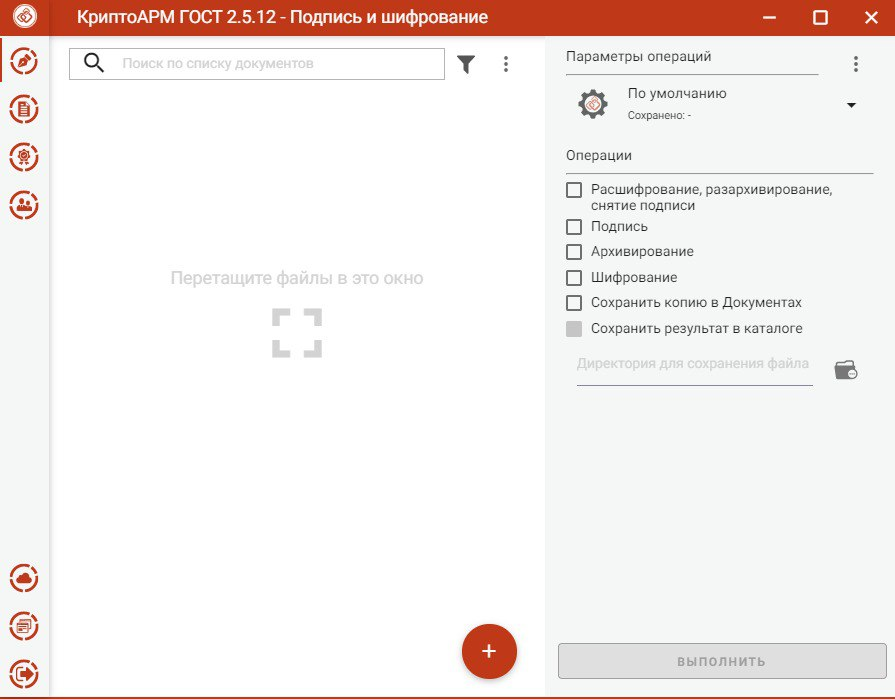

# КриптоАРМ

## Подробнее об установке модуля Крипто АРМ

Перейдите на сайт [https://cryptoarm.ru/#download\_box](https://cryptoarm.ru/#download\_box)  и приобритите модуль КриптоАРМ

### Установка

<figure><figcaption></figcaption></figure>

<figure><figcaption></figcaption></figure>

<figure><figcaption></figcaption></figure>

<figure><figcaption></figcaption></figure>

<figure><figcaption></figcaption></figure>


Подтвердить при необходимости оповещение системы безопасности о внесении изменений в систему.


<figure><figcaption></figcaption></figure>

## Подробнее о подписании документа

Открыть установленный КриптоАРМ (ярлык на рабочем столе)

<figure><figcaption></figcaption></figure>

<figure><figcaption></figcaption></figure>

Заполните адрес службы штампов времени этой ссылкой [http://tax4.tensor.ru/tsp/tsp.srf](http://tax4.tensor.ru/tsp/tsp.srf), включите галочку "Документ просмотрен" и нажмите "Выполнить".

<figure><figcaption></figcaption></figure>

Ваш документ подписан&#x20;
