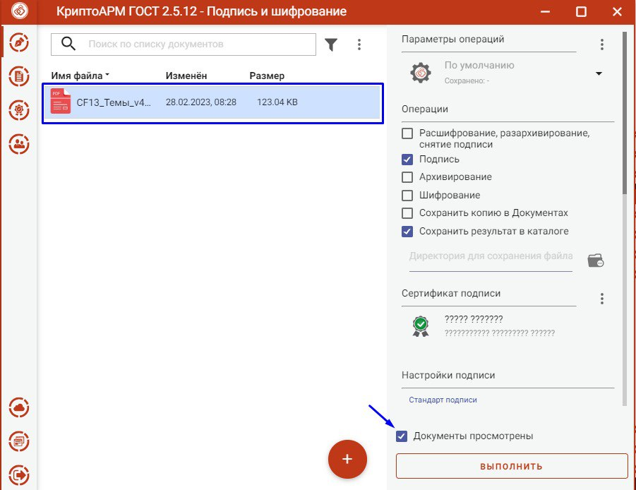

# КриптоАРМ

Подробнее об установке модуля Крипто АРМ

Перейдите на сайт [https://cryptoarm.ru/#download\_box](https://cryptoarm.ru/#download\_box)  и приобритите модуль КриптоАРМ

### Установка

<figure><figcaption></figcaption></figure>

<figure><figcaption></figcaption></figure>

<figure><figcaption></figcaption></figure>

<figure><figcaption></figcaption></figure>

<figure><figcaption></figcaption></figure>


Подтвердить при необходимости оповещение системы безопасности о внесении изменений в систему.


<figure><figcaption></figcaption></figure>


После установки необходимо перезагрузить компьютер!


## Подробнее о подписании документа

Откройте установленный КриптоАРМ (ярлык на рабочем столе)

<figure><figcaption></figcaption></figure>

Выберите сертификат

<figure><figcaption></figcaption></figure>

После выбора сертифика появится вот такая информация с вашими данными

<figure><figcaption></figcaption></figure>

Перетащите документ, который необходимо подписать, в КриптоАРМ.

<figure><figcaption></figcaption></figure>

**Заполните адрес службы штампов времени этой ссылкой** [**http://tax4.tensor.ru/tsp/tsp.srf**](http://tax4.tensor.ru/tsp/tsp.srf)**, включите галочку "Документ просмотрен" и нажмите "Выполнить".**

<figure><figcaption></figcaption></figure>

Введите пин-код вашей Электронной подписи и нажмите "ОК".

<figure><figcaption></figcaption></figure>

Ваш документ подписан&#x20;

<figure><figcaption></figcaption></figure>

В каталоге на компьютере будет 2 файла:&#x20;

* сам подписанный документ
* файл с открепленной подписью в формате sig.

&#x20;Оба файла необходимо загрузить во Flow.
