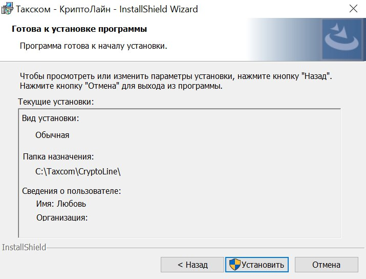

# КриптоЛайн аналог КриптоАРМ

## Инструкция в работе, проводится анализ системы.

## Как загрузить?

Ссылка на загрузку [КриптоЛайн](https://taxcom.ru/support/kriptolayn-el/).

Для корректной работы «КриптоЛайн» на рабочем месте необходимы:

* Доступ к интернету по протоколам http, https;
* Операционная система Windows 7 или выше;
* Microsoft .NET Framework 4.7. (В версиях  Windows, начиная с 10 встроенный);
* Браузер Google Chrome / Mozilla Firefox / Opera / Microsoft Edge;
* Adobe Acrobat Reader версии 7.0 или выше. Скачать можно [здесь](https://get.adobe.com/ru/reader/);
* "КриптоПро CSP" версии не ниже 4.0. [Подробнее о "КриптоПро CSP"](kriptopro.md).

## Как установить?

<figure><figcaption></figcaption></figure>

<figure><figcaption></figcaption></figure>

<figure><figcaption></figcaption></figure>

<figure><figcaption></figcaption></figure>

<figure><figcaption></figcaption></figure>

## Как настроить?

<figure><figcaption></figcaption></figure>

