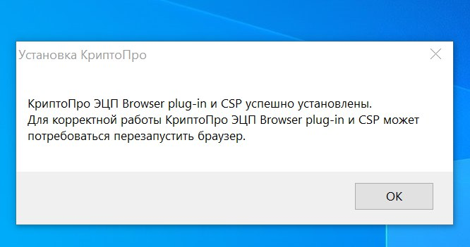
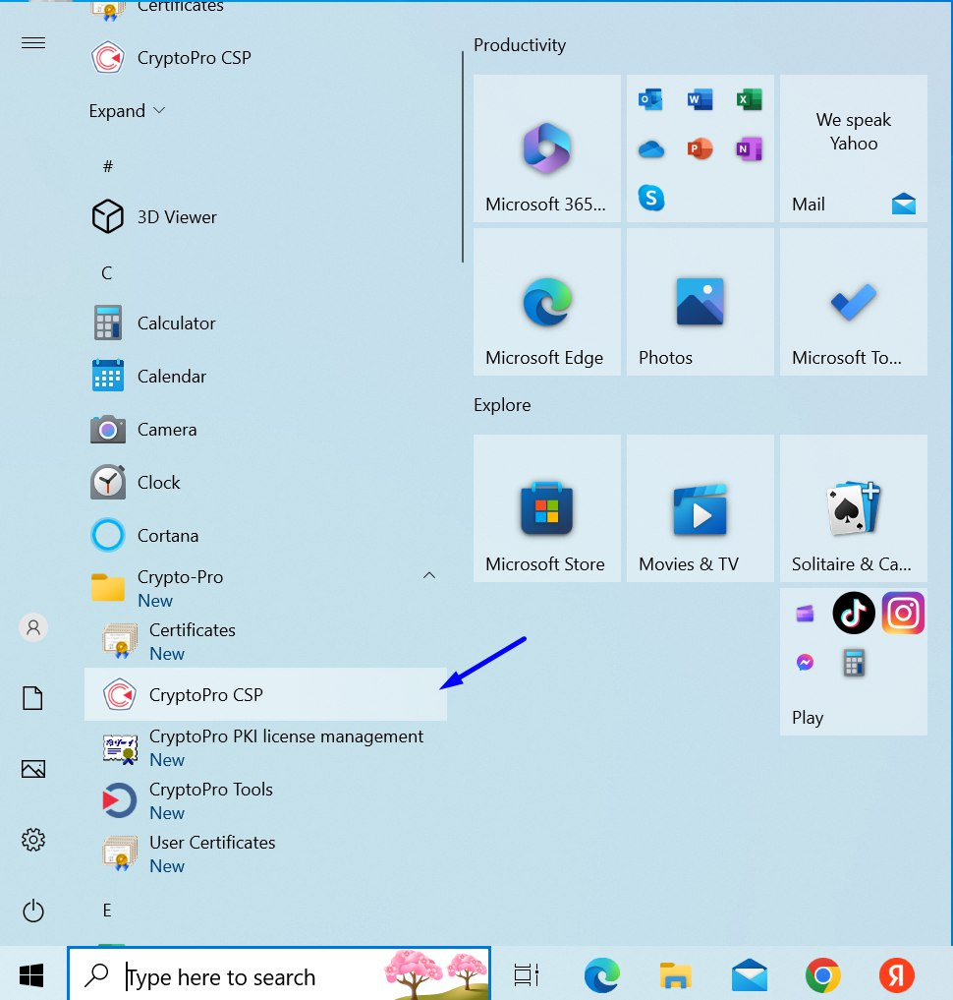

# КриптоПро

## Установка

Для установки КриптоПро CSP необходимо:

1. Приобрести КриптоПро CSP  [https://www.cryptopro.ru/products/csp](https://www.cryptopro.ru/products/csp)
2. Запустить файл установки КриптоПро CSP
3. Выбрать Установить (рекомендуется).

После успешной установки появится окно «КриптоПро CSP успешно установлен». Нажмите "ОК".

<figure><figcaption></figcaption></figure>

## Настройка

1. Запустить КриптоПро CSP через меню Пуск ( наберите CryptoPRO CSP или КриптоПро CSP ).

<figure><figcaption></figcaption></figure>

2. Во вкладке «Общие» нажать кнопку «Ввод лицензии» и ввести лицензионные данные. (Лицензионные данные приходят на электронную почту посте приобретения  КриптоПРО).

<figure><figcaption></figcaption></figure>

3. &#x20;Установка сертификата Головного удостоверяющего центра (ГУЦ) в локальное хранилище компьютера


Напоминаем, установить сертификат, чтобы его возможно было выбрать, необходимо по ссылке&#x20;

[\[ГОСТ 34.10-2012\] Корневой сертификат "Минкомсвязь России"](https://ca.gisca.ru/repository/AFF05C9E2464941E7EC2AB15C91539360B79AA9D.cer) от 02.07.2021


Для установки сертификата ГУЦ в хранилище сертификатов ( Windows) необходимо:

1. Через контекстное меню файла сертификата ГУЦ выбрать пункт меню «Установить сертификат».

<figure><figcaption></figcaption></figure>

2.  Открыть файл.

    <figure><figcaption></figcaption></figure>

На экране отобразится мастер импорта сертификатов (см. Рисунок 5).

<figure><figcaption></figcaption></figure>

&#x20;

Рисунок 5 – Мастер импорта сертификатов

1. 2\)Выбрать хранилище «Текущий пользователь» или «Локальный компьютер» в зависимости от того, должен ли сертификат быть доступен всем пользователям данного компьютера.

Примечание – Если отсутствует возможность выбора хранилища «Локальный компьютер» при наличии такой необходимости, следует обратиться к системному администратору ЛВС для выполнения операции с правами локального администратора АРМ.

1. 3\)Нажать кнопку «Далее».

&#x20;

Рисунок 6 – Выбор хранилища сертификата

1. 4\)В окне «Хранилище сертификата» (см. Рисунок 6) выбрать размещение сертификата вручную, указав поле «Поместить сертификаты в следующее хранилище».
2. 5\)Нажать кнопку «Обзор…».
3. 6\)Откроется окно «Выбор хранилища сертификата» (см. Рисунок 7).

&#x20;

Рисунок 7 – Выбор хранилища сертификата

1. 7\)Выбрать хранилище «Доверенные корневые центры сертификации».
2. 8\)Нажать кнопку «ОК».
3. 9\)Нажать кнопку «Далее» в окне «Хранилище сертификатов».
4. 10\)Откроется окно завершения работы мастера импорта сертификатов (см. Рисунок 8).

&#x20;

Рисунок 8 – Окно завершения работы мастера импорта сертификатов

1. 11\)Нажать кнопку «Готово».
2. 12\)Появится сообщение, что импорт успешно выполнен (см. Рисунок 9).

&#x20;

Рисунок 9 – Завершение установки

1. 13\)Нажать кнопку «ОК».
2.
   1.
      1. Установка КриптоАРМ 5.
3. 1\) Запустить файл установки КриптоАРМ 5, в открывшемся окне выбрать «Настраиваемая установка» и нажать «Далее» (рисунок 10);

Рисунок 10

1. 2\) Отметить для компонента «КриптоАРМ» вариант «Этот компонент и его подкомпоненты будут установлены на локальный жесткий диск» и нажать «Далее» (рисунок 11);

Рисунок 11

1. 3\)Внимательно ознакомиться с условиями лицензионного соглашения, поставить галочку «Я принимаю условия…», и нажать «Начать» (рисунок 12);

\

\

\

&#x20;Рисунок 12

1. 4\) Дождаться окончания установки и нажать «Готово» (рисунок 13) и выполнить перезагрузку АРМ нажав кновку «Да» (рисунок 14);
