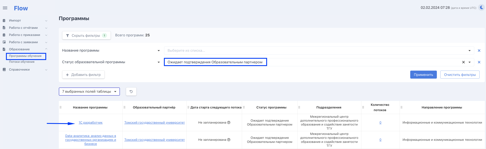

# Справки об успеваемости/посещаемости

На странице заявки в блоке "Обучение" добавлена кнопка "Список справок об успеваемости" Данные для справки поступают из Odin. Справка генерируется 1 раз в месяц (первого числа за предыдущий период не ранее 8-ми часов по мск). &#x20;

<figure><figcaption></figcaption></figure>


Две справки (справка о посещаемости и справка об успеваемости) генерируются в одном pdf-файле.



Справки генерируются только для заявок категории "Безработные граждане, зарегистрированные в органах службы занятости" и необходимы для того, чтобы ЦЗН могли делать выплаты безработным гражданам.


После генерации Справки автоматически доступны  для образовательных партнёров и представителей СЗН.&#x20;

### **Образовательный партнёр**&#x20;

Для каждого гражданина в категории "Безработные граждане, зарегистрированные в органах службы занятости", находящегося в процессе обучения или завершившего обучение в прошлом месяце,  необходимо:

* нажать на странице заявки кнопку "Список справок об успеваемости",
* скачать pdf-файл со справками,&#x20;
* распечатать, подписать,
* поставить печать,&#x20;
* отсканировать,&#x20;
* загрузить скан по кнопке "Редактировать" - иконка "Карандаш".&#x20;

.png>)


Допустимо использование электронных подписей.

Отправлять сканы напрямую в ЦЗН потребности нет. Представители ЦЗН/СЗН имеет доступ в кабинет Flow и могут самостоятельно просмотреть сканы справок.


### **Принцип генерации справок**

Справки генерируются на основании данных из Одина и логика зависит от периода, за который сгенерирована справка:

Справка сформирована до сентября 2022 (включительно)

Если справка берется за период до сентября 2022 (включительно), и гражданин прошел хотя бы одну активность в Одине, то&#x20;

1\) в справке о посещаемости в каждый рабочий день в рамках периода обучения потока ему ставится буква Я (явился)

2\) в справке об успеваемости ему ставится "успевает".

Если у гражданина нет ни одной пройденной активности, то

1\) в справке о посещаемости ему ставится Н (не явился)

2\) в справке об успеваемости ему ставится "не успевает".

Справка сформирована с октября 2022

В данному случае если гражданин посещал хоть 1 раз, то он успевает и регулярно посещает, иначе не успевает и не посещает.


Справка генерируется первого числа, так как должна содержать данные за прошедший месяц.


### Генерация справок для отчислившихся

У безработных граждан, отчисленных по собственному желанию, справки о посещаемости генерируются только до даты отчисления.&#x20;

### Генерация справок для тех, кто заканчивает обучение в середине месяца

У безработных граждан, завершивших обучение,  в любую дату месяца справки о посещаемости генерируются на следующий день после даты завершения обучения.


Если по какой-то причине представленный во Flow бланк справки не подходит образовательной организации, то не запрещено загружать подписанный скан справки по своему образцу.&#x20;

